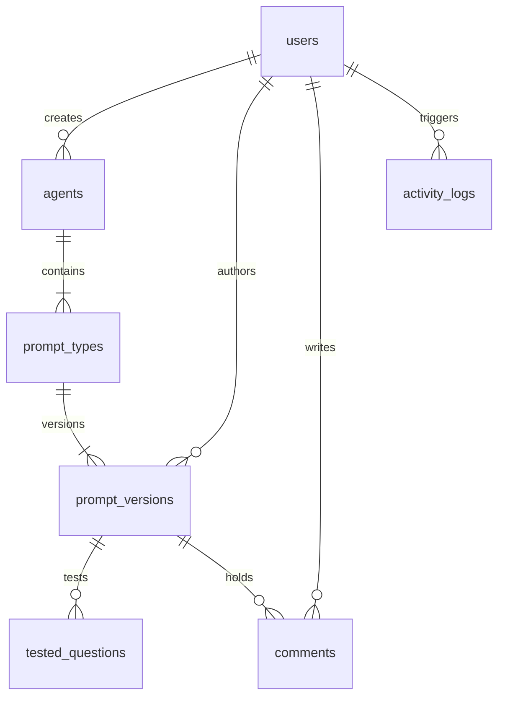

# PromptVault - AI Prompt Versioning & Collaboration Platform

PromptVault is a full-stack web application designed to serve as a **centralized prompt management and version control system** for engineering and product teams building AI agents. 

Rather than sharing prompts through unstructured chats (like MS Teams) where revisions are lost, copy-paste bugs occur, and rollback is difficult, PromptVault brings git-like version control, side-by-side diffing, discussion threads, and automated test cases to prompt engineering.

---

## Key Features

1. **Monaco Workspace Editor**
   - Built-in Monaco Editor with syntax highlighting (SQL, JSON, Markdown).
   - Word count and character count.
   - Interactive line numbers.
   - Action controls for Copy, Download, and Fullscreen toggle.
2. **Git-Like Revision Timeline**
   - Every save commits a new incremental version without overwriting the past.
   - Saves ask for a **mandatory Change Summary** (e.g., *"Added fiscal year boundaries"*) and a Release Status pill (`Draft`, `Testing`, `Production`, `Archived`).
3. **Side-by-Side Version Diff**
   - Powered by Monaco's native `DiffEditor` engine.
   - Visual side-by-side matching highlighting added, deleted, or modified lines.
4. **Preserved History Restore**
   - Restoring a previous version *does not* overwrite history.
   - Clicking restore on Version 3 duplicates its contents as a brand-new Version 15 with a change summary indicating *"Restored from Version 3"*.
5. **Integrated Test Suite Manager**
   - Add test questions, expected outcomes, and actual outcomes.
   - Tracks success parameters: Total tests, passed, failed, and percentage success rate.
   - Includes manual mock triggers to evaluate test states.
6. **Collaboration Comments Thread**
   - Discussion forum attached to each prompt version.
   - Full timestamps and author mapping for collaboration.
7. **Global Search**
   - Full-text search engine matching search keywords against:
     - Agent names and descriptions.
     - Prompt version contents.
     - Change summaries.
     - Test questions and answers.
     - Thread comments.
8. **Audit Trail Log**
   - Complete, immutable system activity logging.
   - Categorizes logs by user, action type, target entity ID, and calendar timestamp.
   - Filters search queries by action type or author.

---

## Tech Stack

### Frontend
- **Framework**: React 19 (TypeScript)
- **Scaffolding/Build**: Vite 8
- **Styling**: Tailwind CSS v4 (supporting clean dark/light mode class variables)
- **Icons**: Lucide Icons
- **Editor**: `@monaco-editor/react` (for the Workspace Editor and Diff View)
- **Data Querying**: `@tanstack/react-query` & `Axios`

### Backend
- **Framework**: FastAPI (Python 3.13)
- **Server**: Uvicorn
- **ORM**: SQLAlchemy 2.0 (supporting interchangeable SQLite/PostgreSQL connectors)
- **Validation**: Pydantic 2.0 (with `email-validator`)
- **Authentication**: JWT (JSON Web Tokens) with direct `bcrypt` password hashing
- **Testing**: `pytest` with local SQLite file-isolation fixtures

---

## Database Schema Design

PromptVault leverages a relational database schema designed for clean migrations:



### Table Mappings
1. **Users** (`users`):
   - `id` (Integer, Primary Key)
   - `name` (String)
   - `email` (String, Unique Index)
   - `password_hash` (String)
   - `role` (String: `Admin`, `Manager`, `Member`)
   - `created_at` (DateTime)
2. **Agents** (`agents`):
   - `id` (Integer, Primary Key)
   - `name` (String)
   - `description` (String, Nullable)
   - `created_by` (Integer, ForeignKey -> Users.id)
   - `created_at` (DateTime)
3. **Prompt Types** (`prompt_types`):
   - `id` (Integer, Primary Key)
   - `agent_id` (Integer, ForeignKey -> Agents.id)
   - `type_name` (String: `System`, `SQL`, `Chart`, `Validation`)
4. **Prompt Versions** (`prompt_versions`):
   - `id` (Integer, Primary Key)
   - `prompt_type_id` (Integer, ForeignKey -> PromptTypes.id)
   - `version_number` (Integer)
   - `content` (Text)
   - `change_summary` (String)
   - `status` (String: `Draft`, `Testing`, `Production`, `Archived`)
   - `author_id` (Integer, ForeignKey -> Users.id)
   - `created_at` (DateTime)
   - `restored_from_version` (Integer, Nullable)
5. **Tested Questions** (`tested_questions`):
   - `id` (Integer, Primary Key)
   - `prompt_version_id` (Integer, ForeignKey -> PromptVersions.id)
   - `question` (Text)
   - `expected_output` (Text)
   - `actual_output` (Text)
   - `status` (String: `PASS`, `FAIL`)
   - `notes` (Text, Nullable)
6. **Comments** (`comments`):
   - `id` (Integer, Primary Key)
   - `prompt_version_id` (Integer, ForeignKey -> PromptVersions.id)
   - `author_id` (Integer, ForeignKey -> Users.id)
   - `comment` (Text)
   - `created_at` (DateTime)
7. **Activity Logs** (`activity_logs`):
   - `id` (Integer, Primary Key)
   - `user_id` (Integer, ForeignKey -> Users.id)
   - `action` (String)
   - `entity_type` (String)
   - `entity_id` (Integer, Nullable)
   - `created_at` (DateTime)

---

## Directory Layout

```text
PromptVault/
├── backend/
│   ├── app/
│   │   ├── api/
│   │   │   └── endpoints.py
│   │   ├── core/
│   │   │   ├── config.py
│   │   │   └── security.py
│   │   ├── database/
│   │   │   └── session.py
│   │   ├── models/
│   │   │   └── models.py
│   │   ├── schemas/
│   │   │   └── schemas.py
│   │   └── main.py
│   ├── tests/
│   │   └── test_api.py
│   ├── requirements.txt
│   └── venv/
└── frontend/
    ├── src/
    │   ├── components/
    │   ├── context/
    │   │   └── ThemeContext.tsx
    │   ├── layouts/
    │   │   └── Layout.tsx
    │   ├── pages/
    │   │   ├── Login.tsx
    │   │   ├── Dashboard.tsx
    │   │   ├── AgentList.tsx
    │   │   ├── AgentDetails.tsx
    │   │   ├── PromptEditor.tsx
    │   │   ├── CompareVersions.tsx
    │   │   ├── Search.tsx
    │   │   ├── ActivityLog.tsx
    │   │   └── Settings.tsx
    │   ├── services/
    │   │   └── api.ts
    │   ├── types/
    │   │   └── index.ts
    │   ├── App.tsx
    │   ├── index.css
    │   └── main.tsx
    ├── vite.config.ts
    └── package.json
```

---

## API Documentation

FastAPI automatically registers interactive Swagger documentation. When the backend is running, visit:
- **Interactive Swagger UI**: `http://localhost:8000/docs`
- **ReDoc alternate view**: `http://localhost:8000/redoc`

### Major Endpoints

| Category | Method | Endpoint | Description |
|---|---|---|---|
| **Authentication** | POST | `/api/v1/login` | Authenticate users and issue JWT |
| | POST | `/api/v1/logout` | Terminate session activity |
| **Users** | GET | `/api/v1/users` | List registered team members |
| | GET | `/api/v1/users/me` | Fetch active user credentials |
| **Agents** | GET | `/api/v1/agents` | Get all agents |
| | POST | `/api/v1/agents` | Create agent (auto-scaffolds 4 prompt types) |
| | PUT | `/api/v1/agents/{id}` | Update agent name/description |
| | DELETE | `/api/v1/agents/{id}` | Permanently delete agent (Managers/Admins only) |
| **Prompt Types** | GET | `/api/v1/agents/{id}/prompt-types` | Fetch types configured for agent |
| | POST | `/api/v1/prompt-types` | Add custom prompt type |
| **Prompt Versions**| GET | `/api/v1/prompt-types/{id}/versions` | List all historical versions (descending) |
| | POST | `/api/v1/prompt-types/{id}/versions` | Commit a new prompt version |
| | GET | `/api/v1/versions/{id}` | Retrieve specific version content |
| | POST | `/api/v1/versions/{id}/restore` | Restore previous version (creates new version entry) |
| | DELETE | `/api/v1/versions/{id}` | Delete prompt version (Admin only) |
| **Comments** | GET | `/api/v1/versions/{id}/comments` | Fetch discussion comments |
| | POST | `/api/v1/versions/{id}/comments` | Post comment to version discussion thread |
| **Test Cases** | GET | `/api/v1/versions/{id}/tests` | Fetch test suite for version |
| | POST | `/api/v1/versions/{id}/tests` | Append test question to suite |
| **Global Search** | GET | `/api/v1/search?q={query}` | Global matching search engine |
| **Audit Trails** | GET | `/api/v1/activity` | List audit logs |
| **KPI Metrics** | GET | `/api/v1/stats` | Fetch dashboard KPI counts |

---

## Local Development Setup

### 1. Backend Setup (FastAPI)
Navigate to the `backend/` directory:
```bash
cd backend
```

Create a virtual environment and install packages:
```bash
python3 -m venv venv
source venv/bin/activate
pip install -r requirements.txt
```

Start the dev server:
```bash
PYTHONPATH=. uvicorn app.main:app --host 0.0.0.0 --port 8000
```
*Note: The backend lifespan automatically creates database tables and seeds initial users and sample data on its first launch.*

#### Running Backend Tests
To execute backend integration tests:
```bash
PYTHONPATH=. pytest
```

---

### 2. Frontend Setup (React/Vite)
Navigate to the `frontend/` directory:
```bash
cd frontend
```

Install packages:
```bash
npm install
```

Start the Vite dev server:
```bash
npm run dev
```

Open `http://localhost:5173/` in your browser.

---

## Default Seed Credentials

For quick evaluation, click the quick access buttons on the Login page or use the credentials below:

- **Administrator**:
  - Email: `admin@promptvault.com`
  - Password: `AdminPass123!`
  - Role: `Admin` (allows deleting versions/agents)
- **Manager**:
  - Email: `manager@promptvault.com`
  - Password: `ManagerPass123!`
  - Role: `Manager` (allows modifying agents/versions)
- **Member**:
  - Email: `member@promptvault.com`
  - Password: `MemberPass123!`
  - Role: `Member` (allows creating versions and tests)
