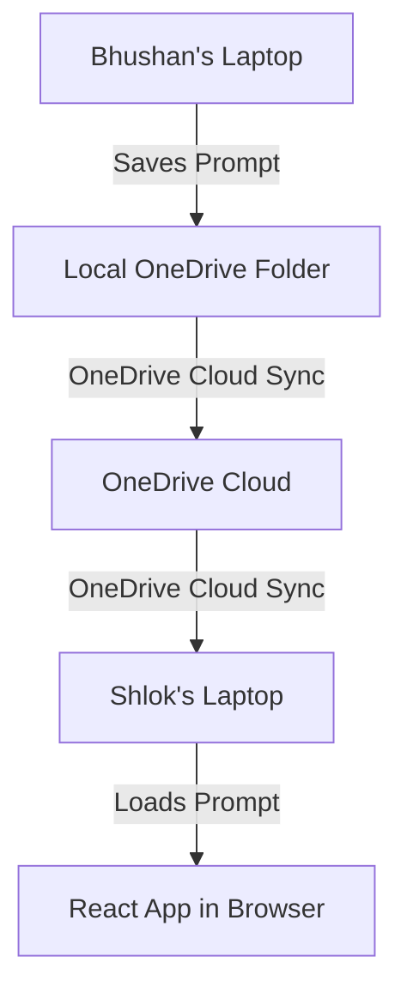

# PromptVault - Microsoft Teams & OneDrive Synced Edition

Welcome to **PromptVault (OneDrive & Teams Edition)**.

This is a **serverless, compliance-friendly** version of PromptVault designed for corporate environments. It does **not** require any external servers, Azure database setups, or IT approvals. 

All your prompt data is stored in a **shared OneDrive folder** on your company laptop, and Microsoft Teams handles the authentication/embedding.

---

## How It Works (The Simple Version)



1. **Shared Database**: Your "database" is just a few simple text files (`.json` files) sitting inside a shared OneDrive folder on your computer.
2. **OneDrive Sync**: When Bhushan (Manager) or Shlok (Member) edits a prompt, the web application writes the changes to their local OneDrive folder. Microsoft OneDrive automatically syncs those files to the other person's laptop in real time.
3. **Browser File Access**: The React app runs inside your web browser (Edge, Chrome, or Safari) and uses a secure modern feature called the **File System Access API** to open and edit the OneDrive folder directly from your laptop.
4. **Compliance Approved**: Since no data ever leaves your company's OneDrive tenant, this setup has **zero compliance issues** and is fully secure.

---

## Step 1: Getting the Code onto your Company Laptop

To move the project from your personal laptop to your company laptop:

1. **Zip the folder**: On your personal laptop, compress the `frontend` folder into a `.zip` file (do **not** include the `backend` folder or `node_modules` folder, as they are not needed for this serverless version).
2. **Transfer the Zip**: Send the `.zip` file to your company email, share it via your corporate OneDrive, or copy it via a corporate-approved USB drive.
3. **Extract on Company Laptop**: Unzip the folder and place it in a workspace directory (e.g., `C:\Code\PromptVault` or `/Users/username/Documents/PromptVault`).

---

## Step 2: Shared OneDrive Database Setup

One of you (e.g., Bhushan) needs to create the shared database folder:

1. Open your corporate **OneDrive** folder on your computer.
2. Create a new folder named `PromptVault_Database`.
3. Right-click the folder, choose **Share**, and enter the email of your team member (e.g., Shlok) with **Can Edit** permissions.
4. Once Shlok accepts the invite, the folder will automatically sync to **both** of your computers via OneDrive.

---

## Step 3: Running the App on your Company Laptop

1. Open the terminal (Command Prompt on Windows, Terminal on Mac) on your company laptop.
2. Navigate to the extracted `frontend` folder:
   ```bash
   cd PromptVault/frontend
   ```
3. Install the required libraries (only needed the first time):
   ```bash
   npm install
   ```
4. Start the application:
   ```bash
   npm run dev
   ```
5. Open your browser and go to: `http://localhost:5173`

---

## Step 4: Connecting the Database (First-Time Setup)

When you first open the app in your browser:

1. The app will show a welcome message: **"Connect your database folder"**.
2. Click the **"Select OneDrive Folder"** button.
3. A file explorer window will pop up. Navigate to your local synced OneDrive directory and select the `PromptVault_Database` folder.
4. Click **Allow/Grant Permissions** in the browser prompt to give read/write access.
5. The app will immediately create three files inside that folder:
   - `agents.json`: Stores your agent groups.
   - `prompts.json`: Stores all prompt configurations, versions, test cases, and comments.
   - `activity.json`: Stores the log of who did what.

---

## User Roles (Bhushan vs Shlok)

Since there is no server handling logins, the app lets you select who you are on the settings page:

1. **Manager (Bhushan)**:
   * Can create new AI Agent workspaces.
   * Can define and create new Prompt Types (e.g., *System Prompt*, *SQL Query Prompt*).
2. **Member (Shlok)**:
   * Can view all agents and prompt workspaces.
   * Can edit prompts, save new prompt versions, run test cases, and add comments.
   * Cannot create new agents or prompt types.

---

## Step 5: How to Embed in Microsoft Teams

To access PromptVault directly inside your Microsoft Teams Channel:

1. Open **Microsoft Teams** and go to your Team Channel.
2. Click the **`+` (Add a tab)** button at the top of the channel page.
3. Select **Website** from the list of tab apps.
4. Enter the details:
   - **Tab Name**: `PromptVault`
   - **URL**: `http://localhost:5173` (or the internal URL where your frontend is hosted).
5. Click **Save**.
6. The dashboard will now load directly inside your Teams channel! When you click it, you can connect your shared OneDrive folder and start managing prompts.
