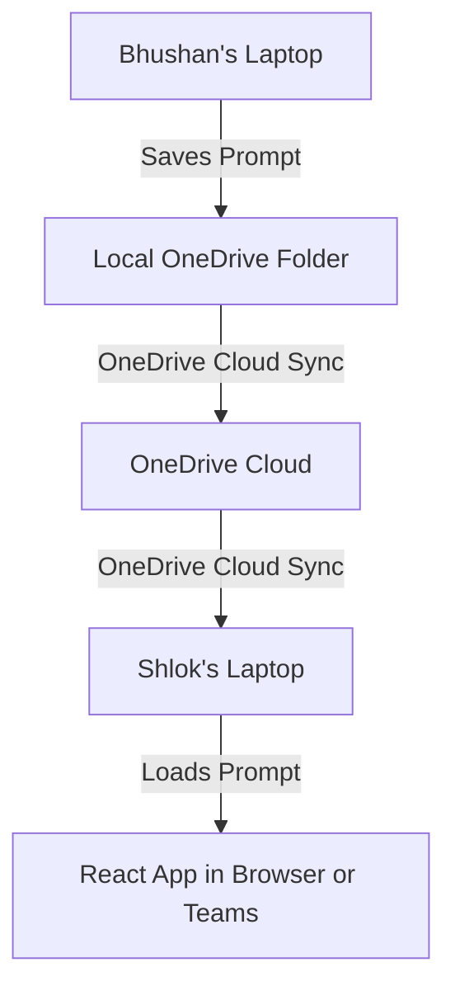

# PromptVault - Microsoft Teams & OneDrive Synced Edition

Welcome to **PromptVault (OneDrive & Teams Edition)**.

This version of PromptVault is designed to be **serverless, corporate-compliant, and self-hosted**. It runs entirely within your company's existing Microsoft 365 environment, using **OneDrive** as your database storage and **Microsoft Teams** as the visual hub.

---

## 1. How It Works (The Core Concept)

Even though this version uses OneDrive as a database, **the user interface is exactly the same**. You get the same beautiful dashboard, sidebar navigation, Monaco prompt editor, diff views, and test managers that you see in the standalone web version.



* **The Website UI**: The React frontend is a standard web application. You can open it in your regular browser (Chrome/Edge) or embed it as a custom tab directly inside your Microsoft Teams Channel.
* **The "Serverless" Database**: Instead of hosting a database server (like SQL or PostgreSQL) which requires corporate security reviews, the web application writes simple, human-readable `.json` database files into a shared folder on your OneDrive.
* **Background Sync**: Microsoft OneDrive automatically synchronizes these JSON files between your laptop, Bhushan's laptop, and the cloud in the background. If Bhushan saves a version, OneDrive syncs the file, and it instantly shows up on your screen.

---

## 2. Step-by-Step Migration to Your Company Laptop

Follow these steps to move the project from your personal laptop and run it on your corporate device:

### Step 2.1: Prepare the Files
1. On your personal laptop, go to the folder where `PromptVault` is saved.
2. Select the `frontend` folder.
3. Compress it into a zip archive (e.g., `PromptVault_Frontend.zip`).
   * *Note: You do **not** need the `backend` folder or any Python/venv files. They are completely replaced by the OneDrive storage code.*

### Step 2.2: Transfer and Extract
1. Send the `.zip` archive to your company laptop (via corporate email, OneDrive file share, or an approved secure USB).
2. Extract the `.zip` archive into a folder on your corporate laptop (for example: `C:\PromptVault` on Windows or `/Users/username/PromptVault` on Mac).

### Step 2.3: Run the Local Development Server
1. Open the **Terminal** (Mac) or **Command Prompt** (Windows) on your company laptop.
2. Change directory into the extracted folder:
   ```bash
   cd PromptVault/frontend
   ```
3. Install the dependencies (only needs to be run once):
   ```bash
   npm install
   ```
4. Start the application:
   ```bash
   npm run dev
   ```
5. The terminal will display a local address. Open your web browser and navigate to:
   `http://localhost:5173`

---

## 3. Database Folder Setup on OneDrive

One team member (e.g., Bhushan) needs to set up the shared database folder:

1. Open your corporate **OneDrive** directory on your laptop file explorer.
2. Create a new folder named `PromptVault_Database`.
3. Right-click the folder and click **Share**.
4. Enter the email address of your team member (e.g., Shlok) and ensure the permission is set to **Can Edit** (allow modifying files).
5. Once Shlok accepts the sharing link, OneDrive will automatically sync the `PromptVault_Database` folder to Shlok's laptop file explorer as well.

---

## 4. Connecting PromptVault to OneDrive

When you launch PromptVault in your web browser (`http://localhost:5173`) for the first time:

1. You will see a prompt saying: **"Connect your database folder to get started"**.
2. Click the **"Select OneDrive Folder"** button.
3. A native file explorer popup will appear. Navigate to your local synced OneDrive directory and click/select the shared `PromptVault_Database` folder.
4. Click **Allow/Grant Permissions** in the browser warning popup. This allows your web browser to securely read and write files in that local folder.
5. The app will immediately create the database files inside that folder:
   - `agents.json`: Stores your agent groups (e.g., *Forecast*).
   - `prompts.json`: Stores all prompt configurations, versions, test cases, and comments.
   - `activity.json`: Stores the audit log of actions.

*Note: You only need to do this connection step once. The browser remembers the folder handle for future visits.*

---

## 5. Managing User Profiles & Roles

Because this edition does not run a centralized user server, roles are configured directly on your local device:

1. Go to the **Settings** tab in the sidebar menu.
2. Under **Profile Configuration**, enter your Name and select your role:
   - **Manager / Team Lead (Bhushan)**: Gives you administrative rights. You can create new agent groups and prompt types (like *System Prompt*, *SQL Query Prompt*).
   - **Member (Shlok)**: Restricts namespace creation. You can write, edit, and version prompts, run test cases, and leave comments.
3. Click **Save Profile**. This identity will be linked to all audit logs, version histories, and comments you write.

---

## 6. Accessing PromptVault inside Microsoft Teams

To view and interact with your prompt versioning workspace inside Microsoft Teams:

1. Open **Microsoft Teams** and navigate to your team channel.
2. Click the **`+` (Add a tab)** icon at the top of the channel screen.
3. Select **Website** from the list of available apps.
4. Set the configuration details:
   - **Tab Name**: `PromptVault`
   - **URL**: `http://localhost:5173` (or the internal URL where the React application is hosted in your company's network).
5. Click **Save**.

The exact same beautiful PromptVault dashboard will now render directly inside your Teams channel tab! You can connect your shared OneDrive folder and collaborate in real-time.
