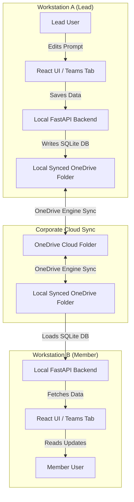

# PromptVault - Microsoft Teams & OneDrive Synced Edition

Welcome to **PromptVault (OneDrive & Teams Edition)**.

PromptVault is a secure, corporate-compliant, and self-hosted prompt version control system. It is designed to run entirely within your organization's existing workstation environment, using **OneDrive** as the database synchronization layer and **Microsoft Teams** as the collaboration tab hub.

---

## 1. Core Concept & Sync Architecture

Unlike standard applications that require complex database server deployments (which often require extensive corporate security and compliance reviews), PromptVault stores data locally in a synced directory. 

* **The Web UI (React)**: Runs locally on your workstation. It can be opened in a browser or embedded as a secure `https://` Website Tab inside a Microsoft Teams channel.
* **The API Backend (FastAPI)**: Runs locally on your workstation and connects to a SQLite database file (`promptvault.db`).
* **Background Sync (OneDrive)**: By pointing the backend's database path to your corporate shared OneDrive folder, all changes (new prompt versions, test cases, and comments) are synchronized across your team in the background by OneDrive's native engine.

---

## 2. Key Features

* **Visual Dashboard**: View prompt updates, active agents, and audit logs.
* **Monaco Editor Integration**: Write and refine prompts using the Monaco editor, featuring word/character counting and standard configuration options.
* **Side-by-Side Version Diff**: Compare different revisions of a prompt side-by-side with clear color-coded differences.
* **Integrated Test Cases**: Log test cases, track expected vs. actual outputs, and record pass/fail results.
* **Collaborative Comments**: Discuss prompt adjustments directly on the revision history.
* **Audit Trail**: Track all actions in a secure history log.

---

## 3. Getting Started

Detailed setup and execution guides are divided into their respective folders:

* **Setup Instructions**: Read the comprehensive [SETUP_GUIDE.md](SETUP_GUIDE.md) in this folder.
* **Frontend Workspace**: See [frontend/README.md](frontend/README.md).
* **Backend API Workspace**: See [backend/README.md](backend/README.md).
